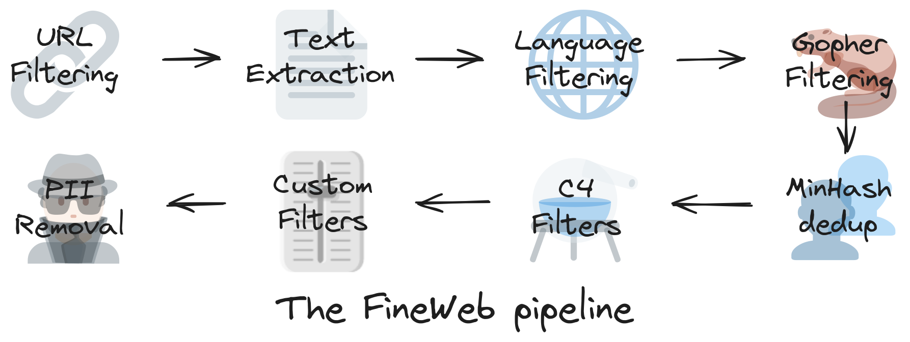
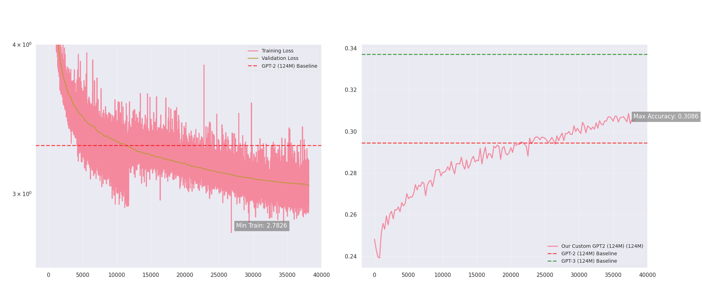

## 📜 Inspired by Key Research Papers:

*   **Attention Is All You Need** (Vaswani et al., 2017)

*   **Language Models are Unsupervised Multitask Learners** (Radford et al., 2019)

*   **Language Models are Few-Shot Learners** (Brown et al., 2020)

**Thanks to Andrej Karpathy’s clear and insightful explanations in his Neural Networks series.**


## 📂 Dataset: FineWeb 10B Tokens

For training our custom GPT-2 model, we utilized the FineWeb dataset with 10 billion tokens. This dataset underwent rigorous filtering to ensure high-quality data selection. Filtering steps included the removal of low-quality web content, duplicate text elimination, and language detection to maintain a clean and diverse corpus. As a result, the model learned from a balanced and representative sample of internet text, enhancing its performance on downstream tasks.



## 🏋 **Training and Evaluaton Details**

*   **GPU:** A100
    
*   **Training Time:** ~23 hours per epoch.

*   **Training Log :** you will find it at src/log
    

To evaluate model performance, we compared our results against GPT-2 and GPT-3 baselines across key metrics like: HellaSwag accuracy.

*   **Training Loss**: Our model achieved a minimum training loss of 2.7826 after one epoch.

*   **Validation Loss**: We recorded a minimum validation loss of 3.0481 after one epoch.

*   **HellaSwag Accuracy**: Our model reached 0.3086, surpassing GPT-2 124M's 0.2945, though remaining below GPT-3 124M's 0.337 "we need more epochs".




**You will find the detailed explanation of the model implementation in the notebook**.

### ✍ **Sample Generation**

#### Generated Sample (Prompt: "Once upon a time in a distant galaxy,")

>_"Once upon a time in a distant galaxy, the Milky Way was the brightest and most populated galaxy in the Universe. By far the largest galaxy is NGC 631, which has a diameter of 13 million light-years."_

>_"NGC 631 is a star-forming region consisting of a cluster of stars that is about the size of our planet and which is currently undergoing a rapid increase in its size. This area is where the stars at NGC 631 are currently being formed."_

>_"NGC 631 is located in the Local Group, a Group of galaxies that include the Milky Way, the Large Magellanic Cloud, the Local Group, the Local Group, and the Local Group."_

#### Generated Sample (Prompt: "The secret to happiness is")

>_"The secret to happiness is to be free from all desire or urge to change."_

>_"This is an important aspect of our happiness, and a necessary part of our goal to have joy. It is one of our major gifts for life."_

>_"Our happiness depends on our ability to understand and accept the world that we live in. Our happiness depends on our ability to enjoy life."_

>_"Living a healthy, fulfilling life can only be achieved if we are healthy and happy. Living a healthy, happy life can only be achieved if we have a healthy diet, exercise, and physical activity."_

#### Generated Sample (Prompt: "In the year 2050, artificial intelligence has")

>_"In the year 2050, artificial intelligence has the potential to transform our lives by offering advanced healthcare, real-time trading, and real-time data that can improve healthcare and reduce healthcare costs."_

>_"There are many examples of AI's potential, of course, and how to use AI in the healthcare industry. The health industry in the U.S. is one of the most diverse in the world."_

>_"But the health care sector in the U.S. is also one of the youngest in the world. This is also a topic of the future, since the cost of health care in the U.S. is higher than in other countries."_

>_"We have the ability to create new healthcare technologies that are affordable and accessible to all patients. This technology can help ensure that patients receive the care that is needed for them to improve their health."_

## Setup/Execution :
Go to **src/gpt2_model** (you have the requirements) , use SSH for getting cloud GPUs :
```bash
python data_download.py # to download the data and tokenize it
python distributed_training.py # for single gpu training
torchrun --nproc_per_node=NUM_GPUS distributed_training.py # For distributed training across multiple GPUs where NUM_GPUS is the number of GPUs you are using.
python load_generate.py # to load the model path "you will find it at the releases" and generate samples.
```

## Continuing Training
The trained model is available as a release and is saved as a PyTorch checkpoint `(final_gpt2_124m.pt)`. The checkpoint contains all necessary components to resume training:
(You will get higher scores by more epochs of training)

```python
# Checkpoint structure
checkpoint = {
    'model': raw_model.state_dict(),    # Model weights and parameters
    'config': raw_model.config,         # Model configuration
    'step': step,                       # Training step
    'val_loss': val_loss_accum.item(), # Validation loss
    'optimizer': optimizer.state_dict() # Optimizer state
}
```
